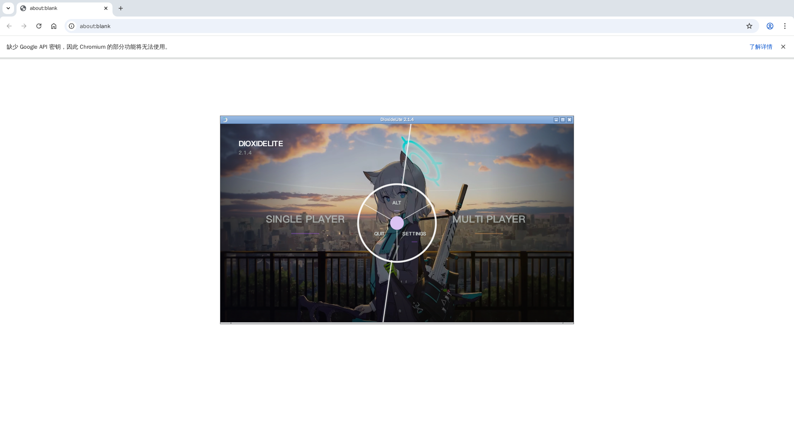
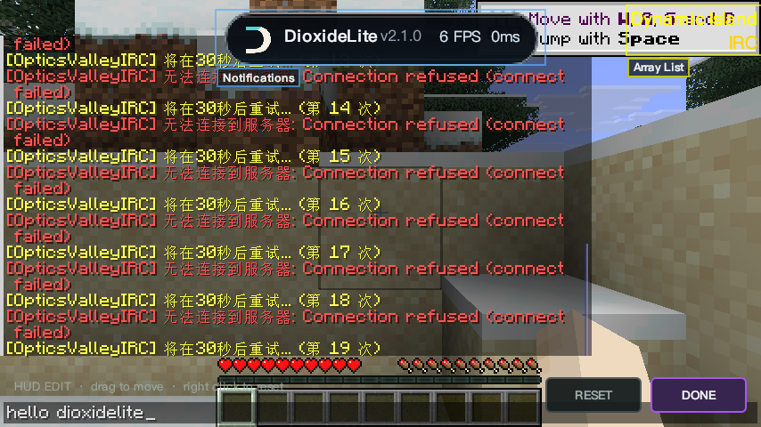
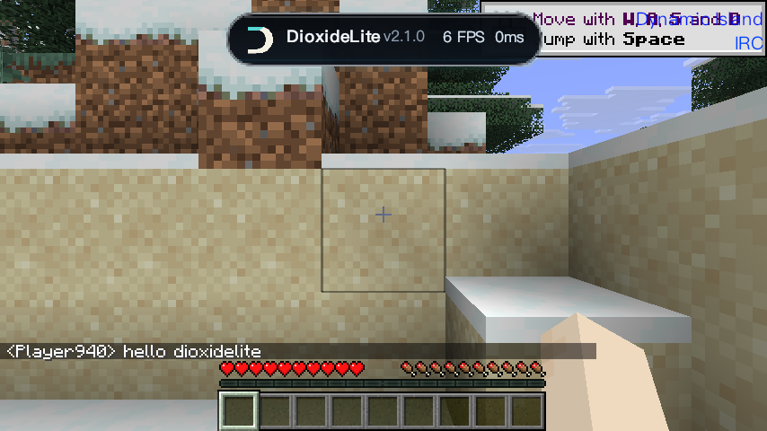
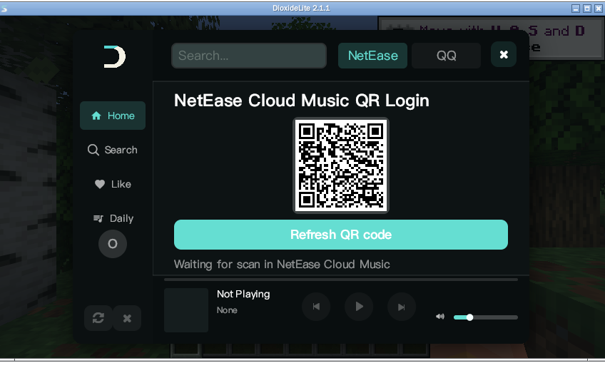
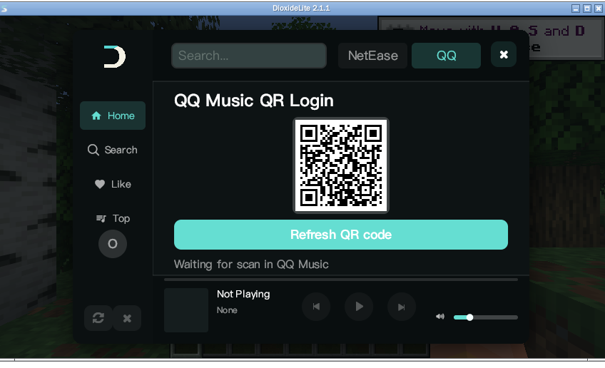

# DioxideLite

**DioxideLite** 是一个基于 Skija 渲染的 Minecraft 视觉客户端（Fabric），为 Minecraft **26.1.2** 打造，专注流畅的 HUD 视觉、ClickGUI 与聊天联动。

> 当前版本：**v2.2.0** · 平台：Fabric · 游戏版本：Minecraft 26.1.2 · JDK 25

---

## 特性

- **Skija GPU 渲染**：全部自绘 UI（ClickGUI / HUD / 灵动岛 / Watermark）走 Skija 渲染，文字锐利、动画流畅。
- **灵动岛（Dynamic Island）**：顶部胶囊信息面板，实时显示客户端版本 / FPS / 延迟。
- **Watermark**：客户端身份水印（默认 `DioxideLite 2.1.2`），支持自定义文字与品牌 Logo。
- **ClickGUI（Pop / Drop）**：右 `Shift` 打开，六分类环形菜单，主题可热切换（无需重启游戏）。
- **HUD Editor**：聊天界面打开时可通过按键唤起，直接拖拽调整 HUD 位置（RESET / DONE）。
- **命令系统（Command）**：客户端命令注册表骨架（v2 明确不暴露任何 gameplay / cheat 命令，`handle` 默认放行至原版）。
- **IRC 聊天联动**（Player → IRC，默认开启）：基于 OpticsValleyIRC 原版协议，IRC 在线用户 Nametag 显示 DioxideLite 品牌 Logo。
- **视觉模块（全量移植）**：世界渲染（HoleESP / Tracers / OreTracers / SpawnerFinder / UHCDetector / Xray）、战斗（KillAura / KillAuraPlus / AntiBot / AutoTotem / Surround / Criticals 等）、移动（Scaffold / Velocity / NoSlow / Speed 等）、玩家（ChestStealer / InvManager / AutoTool / BedAura 等）、TargetHud / ScaffoldBlockHUD、ESP、Chams、Global Blur、Full Bright、Radar 等。
- **内置优化模组**：Sodium / Lithium / FerriteCore 一并内嵌，开箱即用。

## 截图

| v2.2.0 主菜单 | ClickGUI |
| --- | --- |
|  |  |

| 游戏内灵动岛 | Render 视觉模块 |
| --- | --- |
|  |  |

| HUD Editor（聊天界面唤起） | 聊天 |
| --- | --- |
|  |  |

| 游戏内 Music · 网易云 | 游戏内 Music · QQ音乐 |
| --- | --- |
|  |  |

## Lua 脚本使用教程

DioxideLite 内置 Luaj 脚本沙箱，支持游戏内动态加载、运行、停止自定义 Lua 脚本。

### 基础操作

1. 按 **右 Shift** 打开 ClickGUI，进入 `Player` 分类，开启 `LuaScript` 总开关。
2. Lua 模块面板参数：
   - `Script Path`：脚本目录，默认 `<配置目录>/dioxidelite/scripts/`，客户端启动自动创建。
   - `Reload`：重新扫描文件夹内全部脚本。
   - `Run / Stop`：启动 / 终止当前选中脚本。
   - `Print Console`：脚本控制台，查看 `print` 输出、语法与运行报错。
3. 使用流程：
   - 将 `.lua` 脚本文件放入 `dioxidelite/scripts/`。
   - 在面板选中目标脚本，点击 `Run` 运行；使用完毕点 `Stop` 终止。

### DioxideLite Lua 核心 API

```lua
-- 获取本地玩家对象
local player = dioxidelite:getPlayer()
-- 获取游戏世界对象
local world  = dioxidelite:getWorld()
-- 向游戏聊天框发送消息
dioxidelite:sendChat("脚本消息")
-- 获取玩家射线检测信息
local ray = dioxidelite:getRaycast()
-- 设置玩家视角（yaw 水平，pitch 垂直）
dioxidelite:setYawPitch(yaw, pitch)
-- 判断按键是否按住，支持 mouse_right / mouse_left / key_w 等
local holdRight = dioxidelite:isKeyHeld("mouse_right")
```

### 自带脚本

| 脚本 | 说明 |
| --- | --- |
| [`scripts/SpeedTelly.lua`](scripts/SpeedTelly.lua) | 仿绿玩 SpeedTelly 搭路：右键按住 + W/A/D，AIM 瞄准落点 → 放置 → FORWARD_RESET 视角前摆正疾跑 → 循环；平滑转头、角度限幅、落点有效性校验防虚空。 |

#### SpeedTelly 操作方式

1. 将 `SpeedTelly.lua` 放入 scripts 文件夹，加载后 `Run` 启动。
2. 按住鼠标右键，预先瞄准搭路目标区域，脚本自动执行 speedtelly 搭路。
   - 方块放置完成后自动回正视角，维持疾跑提速。
   - 当前版本为硬锁视角，保证瞄准精度。
   - 搭路距离、视角平滑系数、回正速度均可在 Lua 子面板实时调参。
3. 松开鼠标右键，自动停止搭路循环。

### 常见问题

- **脚本不生效**：确认 LuaScript 模块已开启；打开控制台查看报错；脚本编码使用 UTF-8，文件名避免中文特殊字符。
- **切换脚本**：必须先 `Stop` 当前运行脚本，再选择其他脚本 `Run`。
- **客户端重启**：重启后脚本不会自动运行，需手动重新 `Run`；可勾选 AutoLoad 实现开机自动加载。

## 安装

1. 安装 **Fabric Loader ≥ 0.19.2**，游戏版本 **26.1.2**。
2. 安装 **Fabric API**（26.1.2 对应版本）。
3. 将 `DioxideLite-2.2.0.jar` 放入 `.minecraft/mods`。
4. 启动游戏。`右 Shift` 打开 ClickGUI，灵动岛默认开启。

## IRC 使用

- 默认开启（ClickGUI → Player → IRC 可关闭）。
- 需配合 [OpticsValleyIRC](https://github.com/OpticsValley/opticsvalleyirc) 服务器（默认端口 `16688`）。
- 聊天互通：游戏内聊天即发送至 IRC，服务器广播以 `[OpticsValleyIRC]` 前缀显示。
- Nametag Logo：IRC 在线用户名字左侧显示 DioxideLite Logo，仅本客户端可见。

## 构建

使用 JDK 25：

```powershell
.\gradlew.bat clean build
```

产物位于 `build/libs/DioxideLite-2.2.0.jar`（含 sources.jar）。

> 注意：构建依赖 `libs/nested/` 下的内嵌库与 `src/main/java/tritium`、`src/main/java/repackage`（音频 / JSyn 库），均已随仓库提供。

## 更新日志

| 版本 | Devlog |
| --- | --- |
| v2.2.0 | [devlog-2.2.0.md](devlog-2.2.0.md) — Render 优化 + ClickGUI 优化 + 编译修复 |
| v2.1.5 | [devlog-2.1.5.md](devlog-2.1.5.md) — RenderStable OnyxPort + 编译修复 |
| v2.1.4 | [devlog-2.1.4-onyx-engine-migration-cn.md](devlog-2.1.4-onyx-engine-migration-cn.md) — Onyx Engine 迁移 + 11 个新模块 |
| v2.1.3 | [devlog-2.1.3-bilingual.md](devlog-2.1.3-bilingual.md) — OpenOnyx 视觉适配 + OPAI_ONYX 主题 + 多分辨率窗口图标 |
| v2.1.2 | [devlog-2.1.2.md](devlog-2.1.2.md) — 修复 Windows 运行失败 + 去除 setsuna 字样 + 自定义背景 |
| v2.1.1 | [devlog-2.1.1.md](devlog-2.1.1.md) — 视觉模块全量移植 + Music 模块 + 灵动岛 + Lua 脚本沙箱 |
| v2.1.0 | [devlog-2.1.0.md](devlog-2.1.0.md) — 初始 Skija 渲染 + ClickGUI + IRC 联动 |

## 许可

本项目基于 **GPL-3.0-or-later** 开源（详见 [LICENSE](LICENSE)）。

## 联系

QQ：**81622964**
