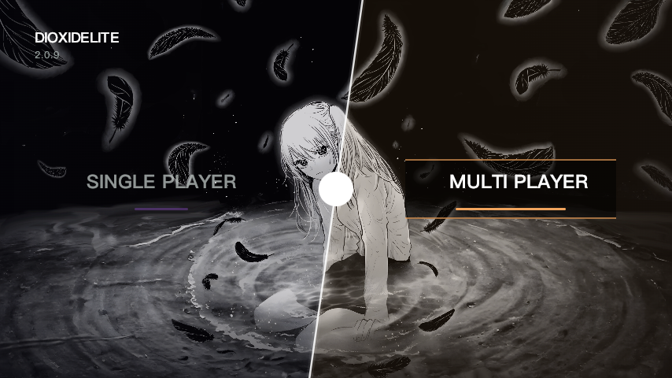
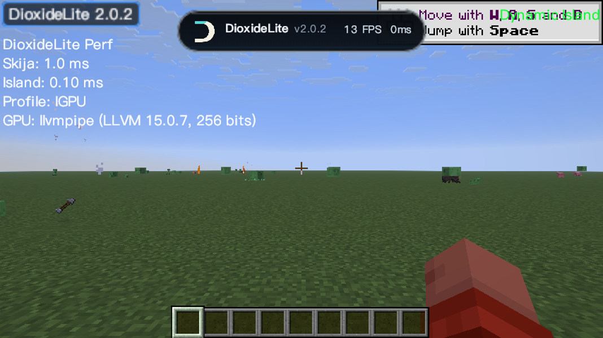
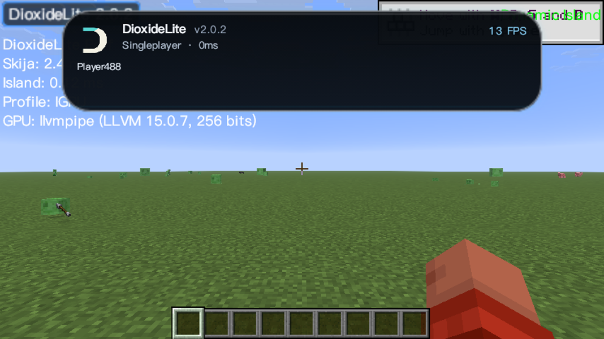
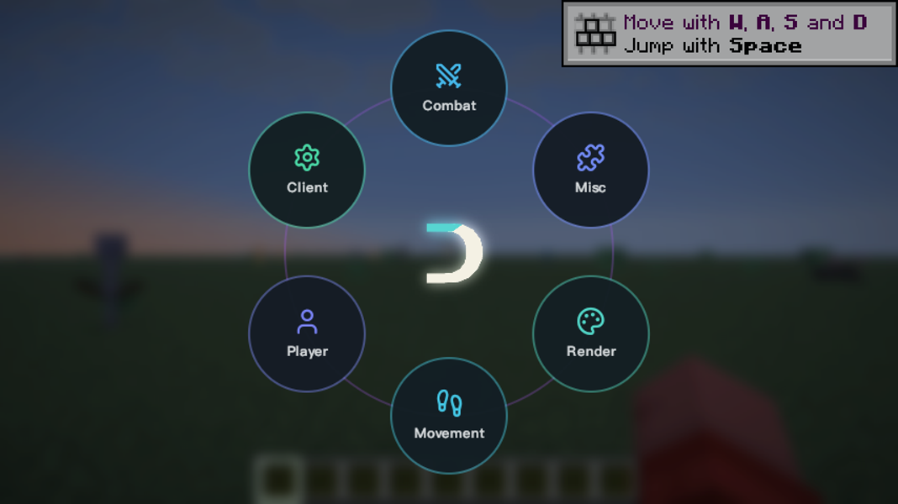
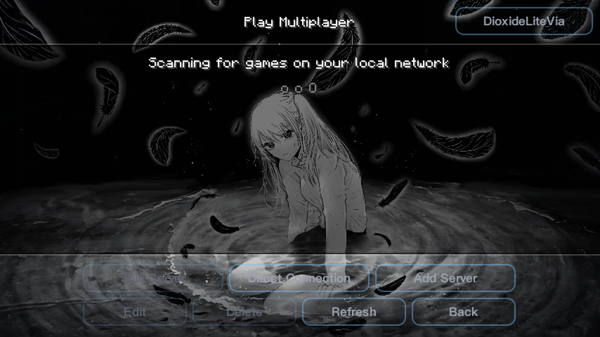
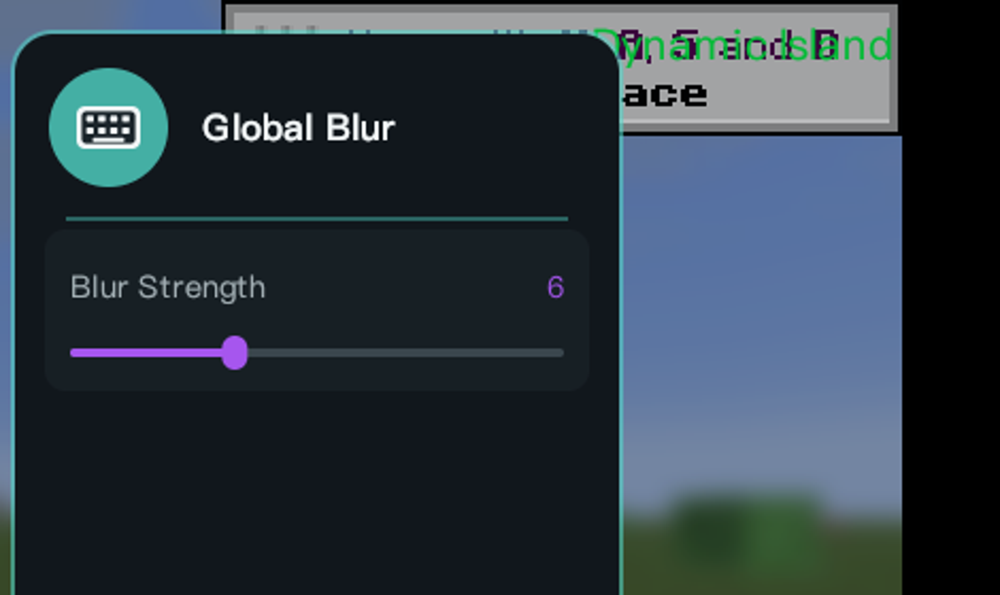

# DioxideLite

**Minecraft 26.1.2 · Fabric · 纯视觉 / QoL PvP 客户端**

DioxideLite 是一个基于 **Skija GPU 渲染**的视觉向 Fabric 客户端：主菜单主题、ClickGUI、灵动岛、HUD 与各类视觉增强全部走共享 Skija 渲染管线。**不含任何自动化/作弊模块**——没有 combat/movement 自动化、发包操作、反作弊绕过或脚本指令。

## 特性

- **主菜单**：DIOXIDELITE 品牌主菜单，角色 + 羽毛动画背景，单机/联机入口
- **ClickGUI**：右 Shift 打开；Pop 环形 / Drop 窗口两种模式；F6 热切换 **Liquid Glass / Minimal / Signature** 三种主题（无需重启）
- **灵动岛**：OPAI 风格暗色玻璃胶囊，顶部居中；紧凑态显示 LOGO/版本/FPS/延迟，按住 Tab 展开玩家列表与服务器信息
- **Global Blur（v2.0.2 新增）**：HUD 背景模糊总开关，默认关闭；开启后统一调节全部 HUD 模糊强度
- **内置优化模组（v2.0.2 新增）**：jar-in-jar 内置 Sodium + Lithium + FerriteCore，免单独安装
- **IRC 聊天桥接（v2.0.3 新增）**：ClickGUI → Player 分类 `IRC` 模块（默认开启），本地/私服聊天桥接；IRC 在线玩家 nametag 显示客户端 Logo（Skija 渲染，Nametag 模块可开关）；灵动岛 Tab 显示 IRC 在线状态；`/irc connect|disconnect|status|send` 聊天命令
- **视觉增强**：Watermark、模块列表、动态背景、渲染增强等 24 个纯视觉/QoL 模块
- **无自动化**：模块列表经核验仅含视觉/HUD/UI 功能

## 版本

| 版本 | 说明 |
|---|---|
| v2.0.4 | Module List 进入 ClickGUI Render 分类；nametag Logo 改 Skija 渲染（FOV/宽度自适应/垂直对齐）；灵动岛与 Watermark 清晰度修复（全分辨率 backdrop + 整像素对齐 + 字号上调） |
| v2.0.3 | IRC 聊天桥接（Player 模块默认开 + nametag Logo + 灵动岛 Tab 状态）；F6 主题切换崩溃修复；移除模块状态通知；恢复 backdrop 降采样 |
| v2.0.2 | Global Blur 全局模糊；内置 Sodium/Lithium/FerriteCore；弃用降采样；通知默认关闭 |
| v2.0.1 | OPAI 灵动岛重构；修复 Skija 采样 API |
| v2.0.0 | Skija 新架构；视觉对齐修复（viaversion/Skia native/命名空间/字体路径） |
| v1.8.2 | 渲染性能优化（Skija 字体补丁） |

## 截图

| 主菜单 | 游戏内 · 灵动岛 + Watermark | 灵动岛 · 展开 |
|---|---|---|
|  |  |  |

| ClickGUI · 环形 | 多人游戏 | Global Blur |
|---|---|---|
|  |  |  |

## 构建

使用 **JDK 25**：

```powershell
.\gradlew.bat clean build
```

构建产物在 `build/libs/`：`DioxideLite-<version>.jar`（Fabric 加载）与 `-sources.jar`。

## 运行

- Minecraft **26.1.2** · Fabric Loader **0.19.2** · Fabric API **0.150.0+**
- 将 jar 放入 `mods/` 目录，用 Fabric 启动即可

## 许可

- 本项目不再基于 pvputils base，采用 **GPL-3.0 + Apache-2.0 双许可**，详见 [LICENSE](LICENSE) 与 [LICENSE-APACHE](LICENSE-APACHE)。

## 联系

QQ **81622964**

祝你游戏愉快。
