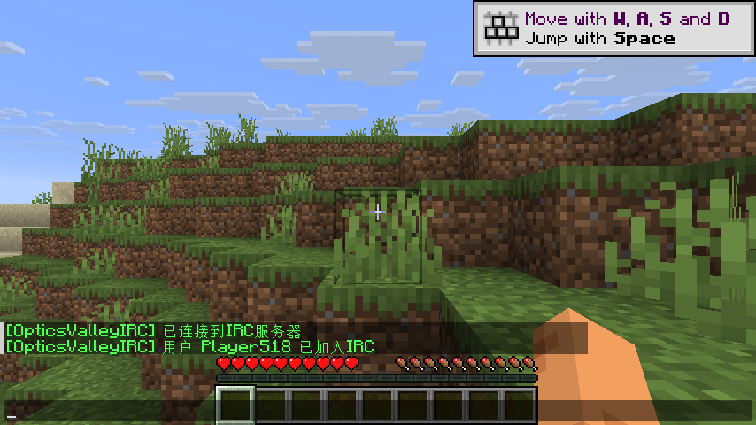
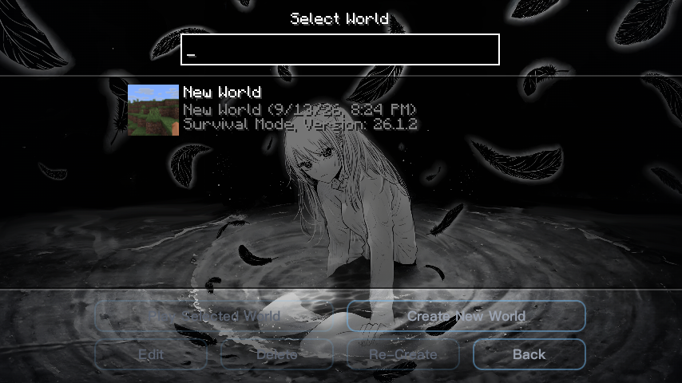

# DioxideLite

**DioxideLite** 是一个基于 Skija 渲染的 Minecraft 视觉客户端（Fabric），为 Minecraft **26.1.2** 打造，专注流畅的 HUD 视觉、ClickGUI 与 IRC 聊天联动。

> 当前版本：**v2.0.8** · 平台：Fabric · 游戏版本：Minecraft 26.1.2

---

## 特性

- **Skija 单趟渲染管线**：每帧只提交一次 Skija 绘制，配合紧凑 GL 状态守卫（FastGlState），大幅降低 HUD 渲染对帧率的影响。
- **灵动岛（Dynamic Island）**：游戏内顶部胶囊型信息面板，实时显示客户端版本 / FPS / 延迟 / 内存，按 `Tab` 展开玩家列表（含 IRC 在线用户）。
- **Watermark**：客户端身份水印，支持自定义文字与品牌 Logo。
- **ClickGUI（Pop / Drop）**：右 `Shift` 打开，两种形态、可热切换主题、可调背景模糊。
- **IRC 聊天联动**（Player → IRC，默认开启）：基于 OpticsValleyIRC 原版协议，连接后聊天互通；IRC 在线用户的 Nametag 会显示 DioxideLite 品牌 Logo；灵动岛玩家列表同步展示 IRC 在线状态。
- **Nametag Logo**：为 IRC 在线玩家在名字左侧渲染 DioxideLite Logo（Skija 渲染）。
- **内置优化模组**：Sodium / Lithium / FerriteCore 一并内嵌，开箱即用。
- **多主题 ClickGUI**：支持主题热切换（无需重启游戏）。

## 截图

| 主菜单 | ClickGUI |
| --- | --- |
|  |  |

| 游戏内灵动岛 | IRC 聊天联动 |
| --- | --- |
|  |  |

| 世界选择 |
| --- |
|  |

## 安装

1. 安装 **Fabric Loader ≥ 0.19.2**，游戏版本 **26.1.2**。
2. 安装 **Fabric API**（26.1.2 对应版本）。
3. 将 `DioxideLite-2.0.8.jar` 放入 `.minecraft/mods`。
4. 启动游戏。IRC 默认连接 `localhost:16688`，可在 ClickGUI → Player → IRC 中修改服务器地址与端口。

## IRC 使用

- 默认开启（ClickGUI → Player → IRC 可关闭）。
- 需配合 [OpticsValleyIRC](https://github.com/OpticsValley/opticsvalleyirc) 服务器（默认端口 `16688`）。
- 聊天互通：在游戏聊天栏输入即发送至 IRC，服务器广播以 `[OpticsValleyIRC]` 前缀显示。
- Nametag Logo：IRC 在线用户的名字左侧会显示 DioxideLite Logo，仅本客户端可见。

## 构建

使用 JDK 25：

```powershell
.\gradlew.bat clean build
```

产物位于 `build/libs/DioxideLite-2.0.8.jar`（含 sources.jar）。

> 注意：构建依赖 `libs/nested/` 下的内嵌库（Setsuna 系列），已随仓库提供。

## 许可

本项目采用 **GPL-3.0-or-later / Apache-2.0 双许可**，详见 [LICENSE](LICENSE) 与 [LICENSE-APACHE](LICENSE-APACHE)。

## 联系

QQ：**81622964**
