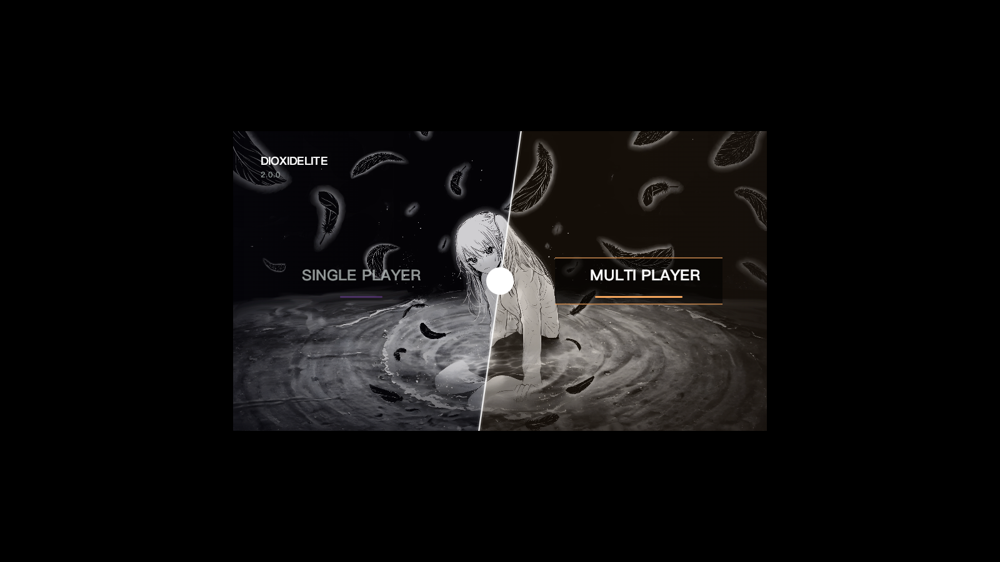
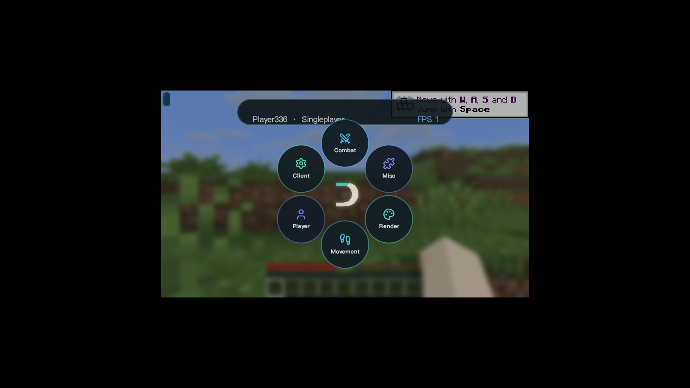
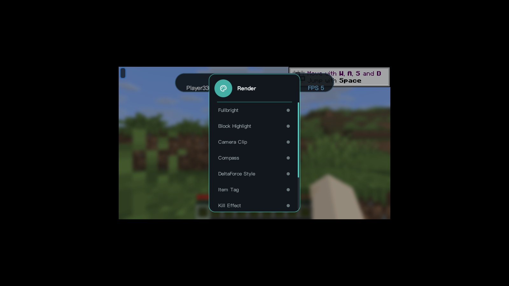
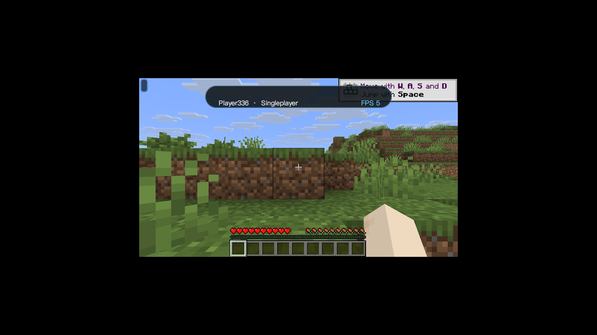
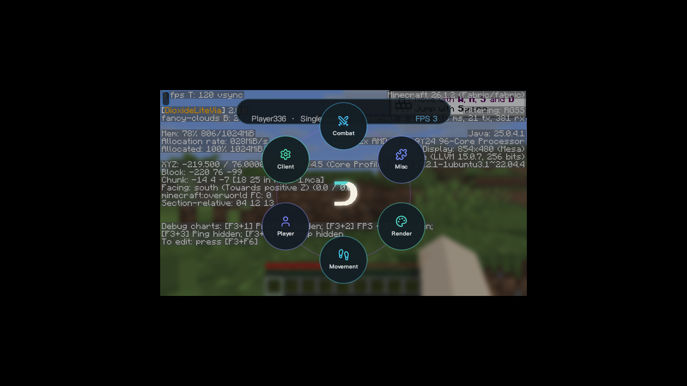

# DioxideLite

> 基于 Fabric 的 Minecraft 客户端模组，专注 **视觉增强与信息可视化**。
> 纯视觉 / QoL 定位，**不含任何自动化作弊模块**。

当前版本：**v2.0.0**（visual-parity 修复版） · Minecraft **26.1.2** · Java 25 · Fabric Loader **0.19.2** · Fabric API **0.150.0+**

---

## ✨ 功能特性

### 🎨 UI 与渲染
- **Skija GPU 渲染**：圆角窗口、阴影、半透明玻璃质感，UI 与游戏帧渲染分离
- **多主题 ClickGUI**：Liquid Glass / Aurora / Minimal / Signature 等主题，**F6 一键即时切换**（无需重启）
- **Dynamic Island 灵动岛**：宽度、高度、模糊、透明度独立可调并持久化
- **完整 HUD**：Watermark、模块列表、玩家信息等

### 👁 视觉模块（Render）
- **Fullbright** 全亮
- **Block Highlight** 方块高亮
- **Camera Clip** 相机透视
- **Compass** 方位罗盘
- **DeltaForce Style** 特殊渲染风格
- **Item Tag** 物品标签
- **Kill Effect** 击杀特效

### 🔌 协议与兼容
- **DioxideLiteVia**（viaversion 集成）：支持跨版本连接、Bedrock 协议兼容
- 模块化管理，全部可视化配置，无配置文件手改负担

---

## 📸 运行截图

### 主菜单


### ClickGUI（右 Shift 打开，环形分类菜单）


### Render 视觉模块分类


### 游戏内界面


### F3 调试（DioxideLiteVia 协议状态可见）


---

## 🚀 快速开始

### 构建（内置完整开发环境）

要求 JDK 25：

```powershell
.\gradlew.bat clean build
```

产物输出到 `build/libs/`：`DioxideLite-2.0.0.jar`（直接安装用）+ `DioxideLite-2.0.0-sources.jar`（源码包）。

### 安装

1. 安装 [Fabric Loader 0.19.2+](https://fabricmc.net/use/)
2. 将 `DioxideLite-2.0.0.jar` 放入 `.minecraft/mods/`
3. 启动游戏（需要 Fabric API 0.150.0+）

### 快捷键

| 按键 | 功能 |
|------|------|
| 右 Shift | 打开 / 关闭 ClickGUI |
| F6 | 游戏内即时切换 UI 主题 |
| F3 | Minecraft 调试界面 |

---

## 📬 联系方式

- **QQ：81622964**
- 视觉设计优化、宣传片制作：完全免费

---

## 📄 开源声明

本仓库为 DioxideLite 的开源版本，**允许任何形式的二次开发、魔改乃至售卖**，使用请遵循仓库内 LICENSE（GPL-3.0 + Apache-2.0 双许可）的相应条款。

> 只想为这个圈子贡献一份自己的力量，少一些争执，多一些包容。
