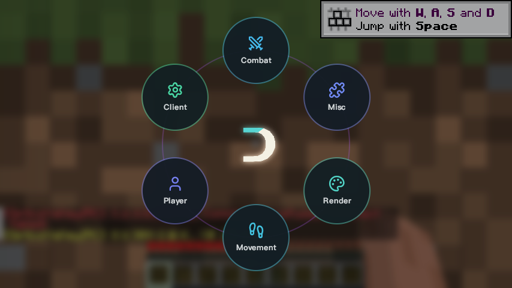
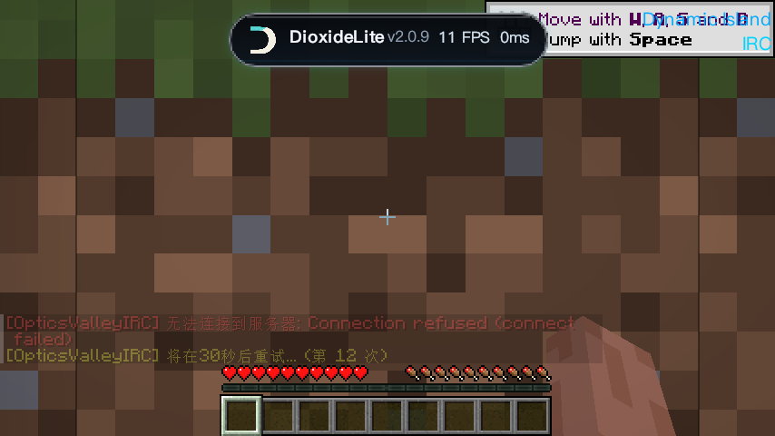
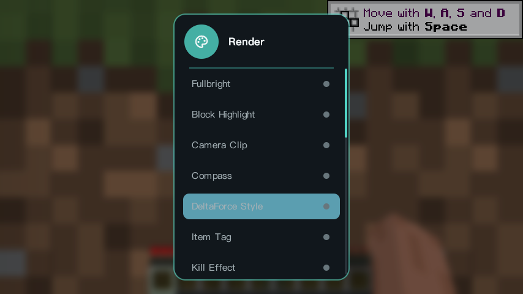
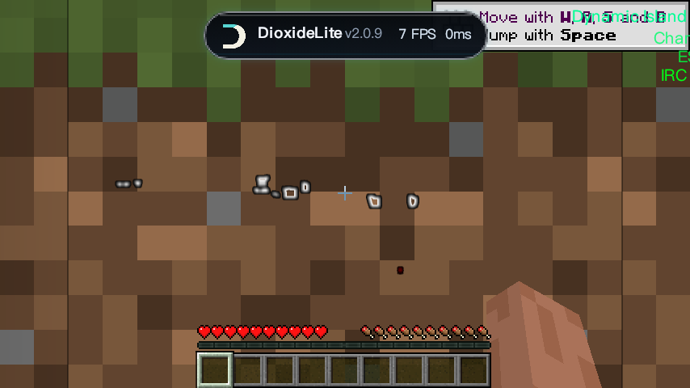

# DioxideLite

**DioxideLite** 是一个基于 Skija 渲染的 Minecraft 视觉客户端（Fabric），为 Minecraft **26.1.2** 打造，专注流畅的 HUD 视觉、ClickGUI 与完整实体视觉体系。

> 当前版本：**v2.0.9** · 平台：Fabric · 游戏版本：Minecraft 26.1.2 · JDK 25

---

## 特性

- **Skija GPU 渲染**：全部自绘 UI（ClickGUI / HUD / 灵动岛 / Watermark）走 Skija 渲染，文字锐利、动画流畅。
- **Setsuna 视觉迁移（v2.0.9）**：
  - **ESP**：玩家 / 容器描边与轮廓。
  - **Chams**：可配置的忽略深度实体渲染与发光描边。
  - **Name Tags**：投影姓名 / 生命 / 队伍旗帜标签，DioxideLite Logo 锚定在标签左缘（随相机移动贴合）。
  - **Target HUD**：自动选取 `Player Search Distance` 内的最近玩家（纯视觉）。
  - **Scaffold HUD**：手持方块时显示方块图标 / 数量 / BPS（纯视觉，不含自动化放置）。
  - **Attack Ring**：最近玩家周围的视觉环（纯视觉，不自动攻击）。
  - **Combat Visuals**：第一人称挥剑动画与格挡动画（仅渲染）。
  - **Team Viewer**：Apollo 队伍 HUD / 标记与队伍消息视觉集成。
  - **Music**：网易云 / QQ 音乐屏幕 + 歌词 HUD（视觉集成）。
- **灵动岛（Dynamic Island）**：顶部胶囊信息面板，显示客户端版本 / FPS / 延迟。
- **Watermark**：客户端身份水印（默认 `DioxideLite 2.0.9`），支持自定义文字与品牌 Logo。
- **ClickGUI（Pop / Drop）**：右 `Shift` 打开，六分类环形菜单，主题可热切换（无需重启游戏）。
- **IRC 聊天联动**（Player → IRC，默认开启）：基于 OpticsValleyIRC 原版协议，IRC 在线用户 Nametag 显示 DioxideLite 品牌 Logo。
- **内置优化模组**：Sodium / Lithium / FerriteCore 一并内嵌，开箱即用。

## 截图

| 主菜单 | ClickGUI |
| --- | --- |
|  |  |

| 游戏内灵动岛 | Render 视觉模块 |
| --- | --- |
|  |  |

| 视觉模块开启（Chams 等） |
| --- |
|  |

## 安装

1. 安装 **Fabric Loader ≥ 0.19.2**，游戏版本 **26.1.2**。
2. 安装 **Fabric API**（26.1.2 对应版本）。
3. 将 `DioxideLite-2.0.9.jar` 放入 `.minecraft/mods`。
4. 启动游戏。`右 Shift` 打开 ClickGUI，灵动岛默认开启。

## IRC 使用

- 默认开启（ClickGUI → Player → IRC 可关闭）。
- 需配合 [OpticsValleyIRC](https://github.com/OpticsValley/opticsvalleyirc) 服务器（默认端口 `16688`）。
- 聊天互通：游戏内聊天即发送至 IRC，服务器广播以 `[OpticsValleyIRC]` 前缀显示。
- Nametag Logo：IRC 在线用户名字左侧显示 DioxideLite Logo，仅本客户端可见。

## 构建

使用 JDK 25：

```powershell
.\gradlew.bat clean build
```

产物位于 `build/libs/DioxideLite-2.0.9.jar`（含 sources.jar）。

> 注意：构建依赖 `libs/nested/` 下的内嵌库（Setsuna 系列）与 `src/main/java/tritium`、`src/main/java/repackage`（音乐视觉所需的音频 / JSyn 库），均已随仓库提供。

## 许可

本项目基于 **GPL-3.0-or-later** 开源（详见 [LICENSE](LICENSE)）。

## 联系

QQ：**81622964**
