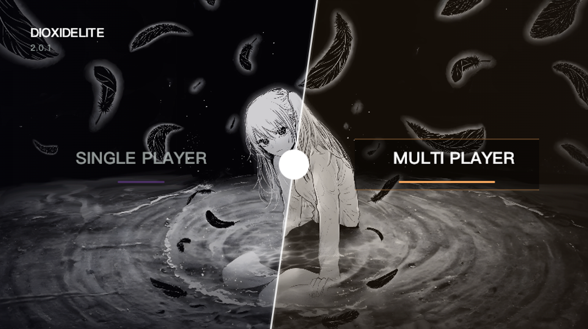
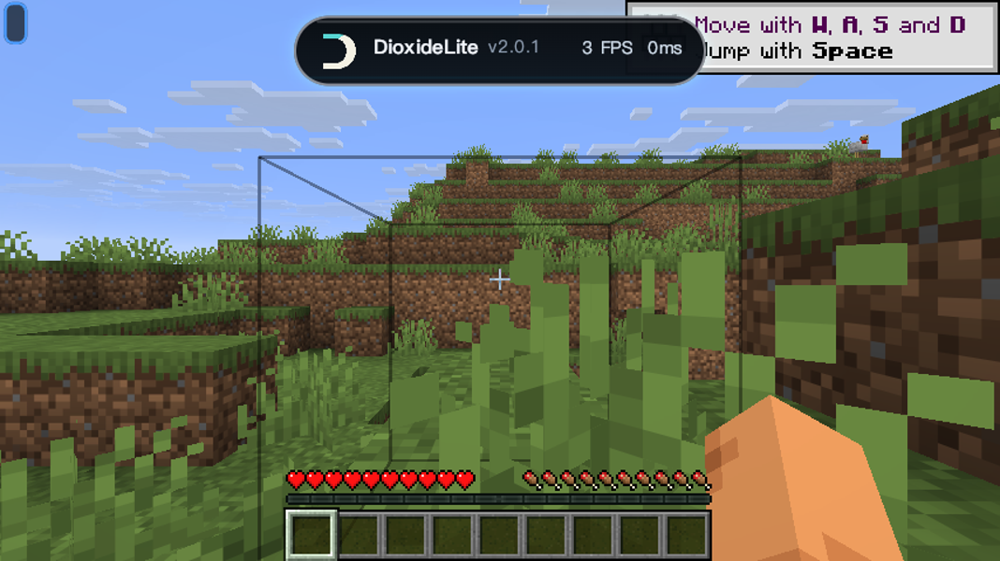
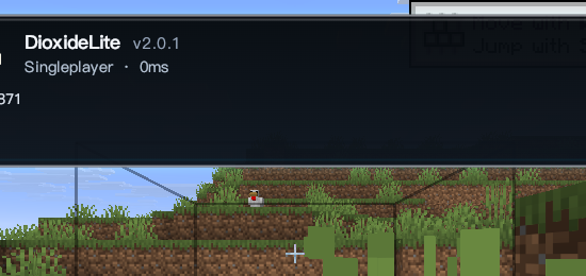
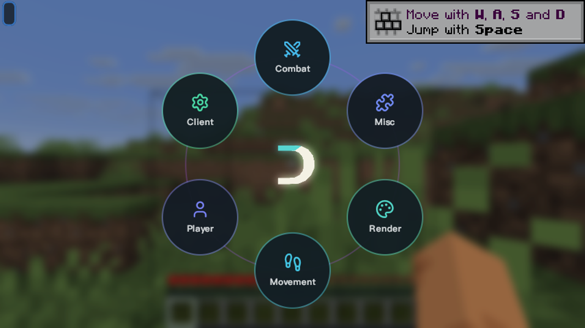

# DioxideLite

**Minecraft 1.21.11 · Fabric · 纯视觉 / QoL PvP 客户端**

DioxideLite 是一个基于 **Skija GPU 渲染**的视觉向 Fabric 客户端：主菜单主题、ClickGUI、灵动岛、HUD 与各类视觉增强全部走共享 Skija 渲染管线。**不含任何自动化/作弊模块**——没有 combat/movement 自动化、发包操作、反作弊绕过或脚本指令。

## 特性

- **主菜单**：DIOXIDELITE 品牌主菜单，角色 + 羽毛动画背景，单机/联机入口
- **ClickGUI**：右 Shift 打开；Pop 环形 / Drop 窗口两种模式；F6 热切换 **Liquid Glass / Minimal / Signature** 三种主题（无需重启）
- **灵动岛（v2.0.1 新增）**：OPAI 风格暗色玻璃胶囊，顶部居中；紧凑态显示 LOGO/版本/FPS/延迟，按住 Tab 展开玩家列表与服务器信息
- **视觉增强**：Watermark、模块列表、动态背景、渲染增强等 24 个纯视觉/QoL 模块
- **无自动化**：模块列表经核验仅含视觉/HUD/UI 功能

## 版本

| 版本 | 说明 |
|---|---|
| v2.0.1 | OPAI 灵动岛重构；修复 Skija 采样 API |
| v2.0.0 | Skija 新架构；视觉对齐修复（viaversion/Skia native/命名空间/字体路径） |
| v1.8.2 | 渲染性能优化（Skija 字体补丁） |

## 截图

| 主菜单 | 游戏内 · 灵动岛 |
|---|---|
|  |  |

| 灵动岛 · 展开 | ClickGUI · 环形 |
|---|---|
|  |  |

## 构建

使用 **JDK 25**：

```powershell
.\gradlew.bat clean build
```

构建产物在 `build/libs/`：`DioxideLite-<version>.jar`（Fabric 加载）与 `-sources.jar`。

## 运行

- Minecraft **1.21.11（26.1.2）** · Fabric Loader **0.19.2** · Fabric API **0.150.0+**
- 将 jar 放入 `mods/` 目录，用 Fabric 启动即可

## 许可

- 本项目不再基于 pvputils base，采用 **GPL-3.0 + Apache-2.0 双许可**，详见 [LICENSE](LICENSE) 与 [LICENSE-APACHE](LICENSE-APACHE)。

## 联系

QQ **81622964**

祝你游戏愉快。
