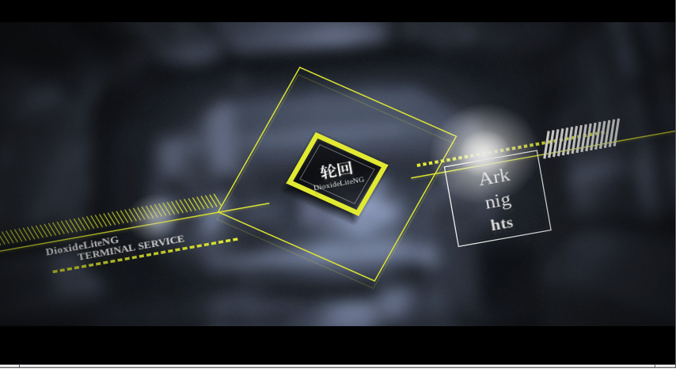
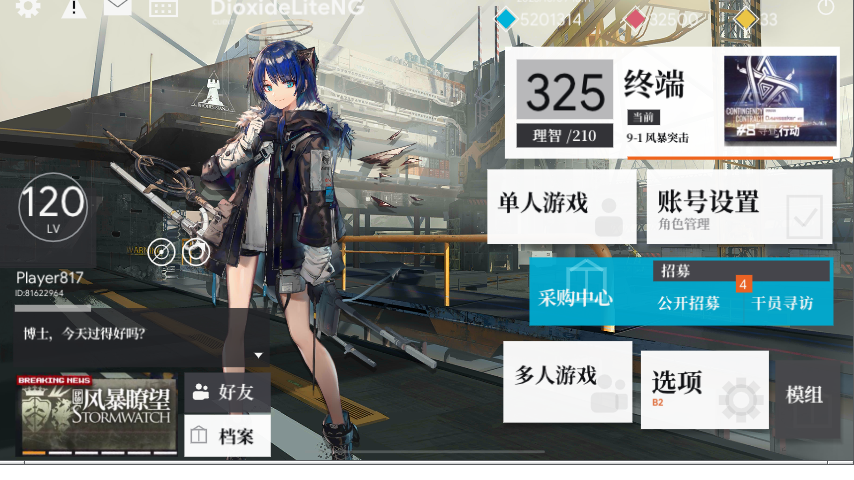
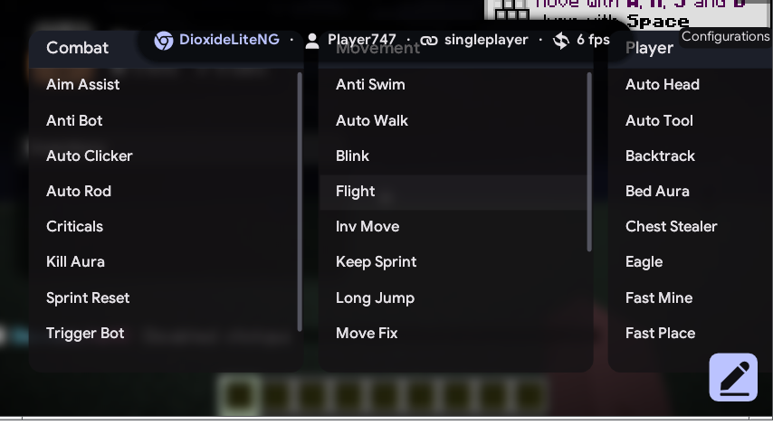
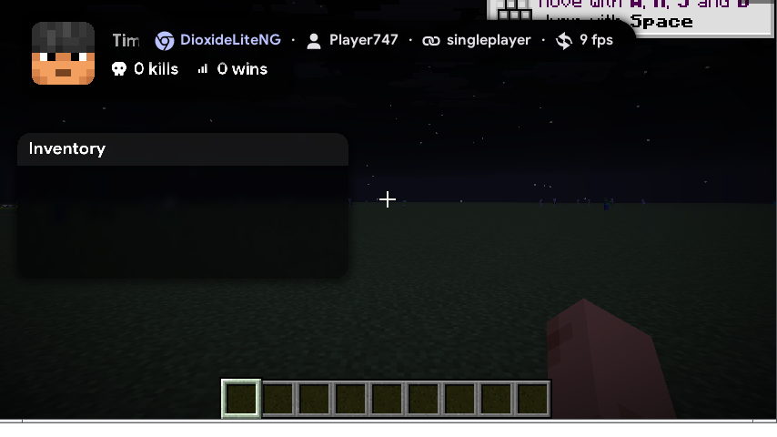

# DioxideLite

<div align="center">
    
</div>

**DioxideLite** 是一个基于 Mixin 运行时注入的开源 Minecraft 视觉客户端（Fabric），为 Minecraft **26.3** 打造，专注流畅的 HUD 视觉、ClickGUI 与启动体验。

> 当前版本：**B2** · 平台：Fabric · 游戏版本：Minecraft 26.3 · Java 25 · 支持 Windows / Linux / macOS

---

## 特性

- **启动动画**：自定义 LaunchIntro 四阶段启动动画（boot → login → connection → emblem），「轮回」品牌标识 + TERMINAL SERVICE 登录窗，约 13 秒。
- **主菜单（干员主题）**：「风暴瞭望 STORMWATCH」活动入口、干员立绘、终端数值面板（理智 / 等级 / 关卡进度 / 日期横幅）。
- **渐变品牌消息前缀**：聊天每字符按色相渐变渲染。
- **ClickGUI**：多主题布局，左键开关模块、右键展开设置，GUI Scale 可调。
- **HUD 编辑器**：ClickGUI 右下角铅笔按钮进入，自由拖拽排版（RESET / DONE）。
- **DynamicIsland 灵动岛**：顶部胶囊信息面板，实时显示客户端版本 / FPS / 延迟。
- **账户管理**：微软登录（内嵌 WebView）、Altening 会话、账户保存与切换。
- **模块体系（55 个）**：
  - **Combat（10）**：KillAura、AimAssist、AutoClicker、AutoRod、Criticals、TriggerBot、Velocity、AntiBot、SprintReset、TargetSettings
  - **Movement（13）**：Speed、Flight、LongJump、Blink、Timer、Stasis、Sprint、KeepSprint、InventoryMove、NoSlow、AntiSwim、AutoWalk、MovementCorrection
  - **Player（13）**：Scaffold、BedAura、ChestStealer、Backtrack、Eagle、AutoHead、AutoTool、FastMine、FastPlace、InventoryManager、LagRange、NoFall、NoJumpDelay
  - **Visual（13）**：ClickGui、Hud、NameTags、PlayerEsp、Scoreboard、Ambience、Animations、AntiFire、BedPlates、Cape、FullBright、NoHurtCamera、Theme
  - **Misc（3）**：Disabler、Whitelist、WindCharge
- **工程与安全**：分布式事件总线（EventBus）、模块生命周期管理（FeatureManager）、原子化配置持久化（AtomicFiles / ClientStateStore）、`.config save/load` 预设、Mixin 注入覆盖渲染 / 输入 / 网络 / 菜单多个切面。

## 截图

| 启动动画 | 主菜单 |
| --- | --- |
|  |  |

| ClickGUI | HUD 游戏界面 |
| --- | --- |
|  |  |

## 使用方式

1. 按 `./gradlew build` 构建得到 `build/libs/dioxideliteng-b2.jar`。
2. 为 Minecraft 26.3 安装 Fabric Loader 0.19.5+。
3. 将 jar 放入 `mods` 目录，用 Java 25 启动 Fabric 档位。
4. **Right Shift** 打开 ClickGUI；聊天输入 `.help` 查看指令；`.config save/load <name>` 管理预设。
5. 自动状态存于 `dioxideliteng/state.json`，预设存于 `dioxideliteng/configs/`（游戏目录下）。

## 构建

使用 JDK 25（Temurin 25.0.4.1 LTS）：

```bash
./gradlew clean build
```

产物位于 `build/libs/`：

- `dioxideliteng-b2.jar`（含内嵌依赖与各平台 JavaFX / LWJGL native）
- `dioxideliteng-b2-sources.jar`

测试：**246 项**（JUnit 5 / Jupiter），skipped 0，failures 0，errors 0。

> 预构建产物位于 `dist/`：`dist/dioxideliteng-b2.jar` 与 `dist/dioxideliteng-b2-sources.jar`。

## 更新日志

| 版本 | Devlog |
| --- | --- |
| B2 | [devlog-b2.md](devlog-b2.md) — 视觉改版：启动动画与主菜单视觉升级 + ClickGUI / HUD 视觉调整 + 全平台构建验证 |

详细更新记录见 [CHANGELOG.md](CHANGELOG.md)。

## 许可

本项目基于 **GPL-3.0-or-later** 开源（详见 [LICENSE](LICENSE)）。

## 联系

QQ：**81622964**
