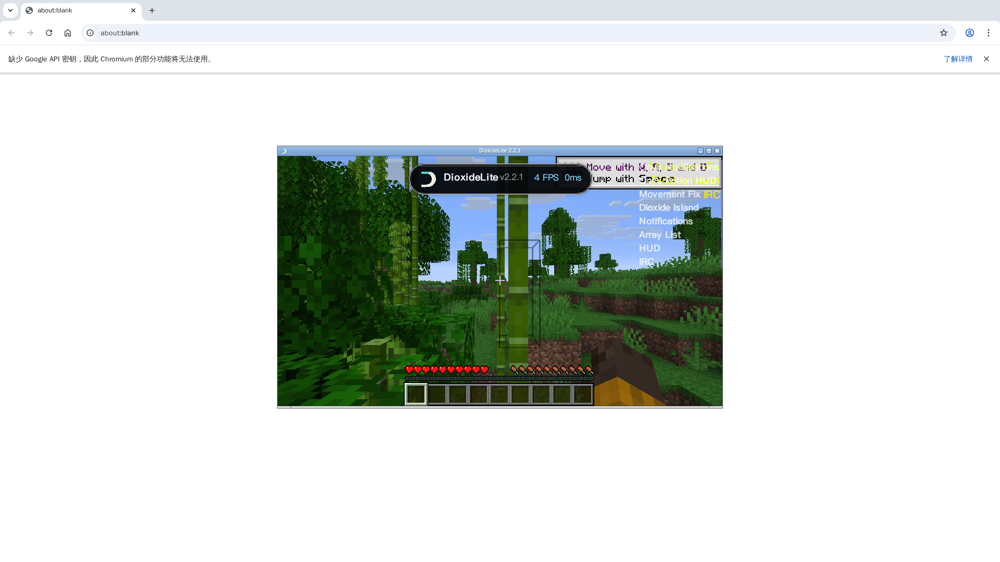
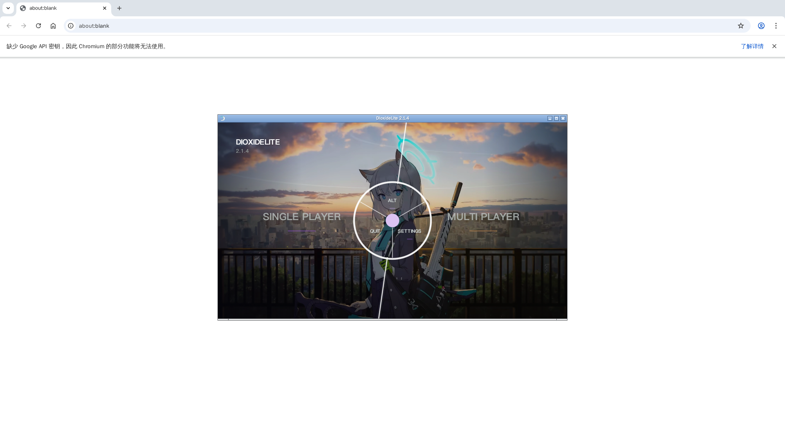
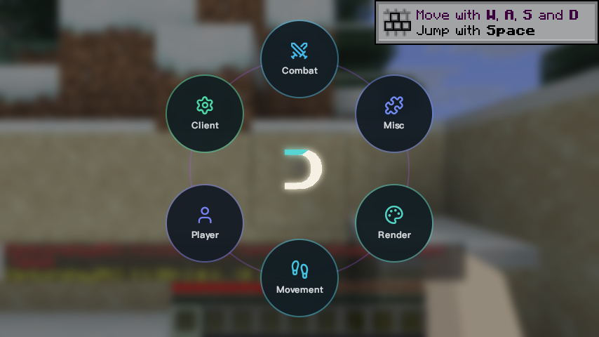
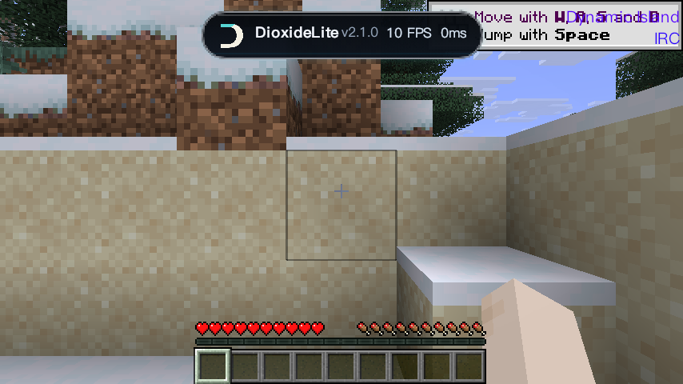
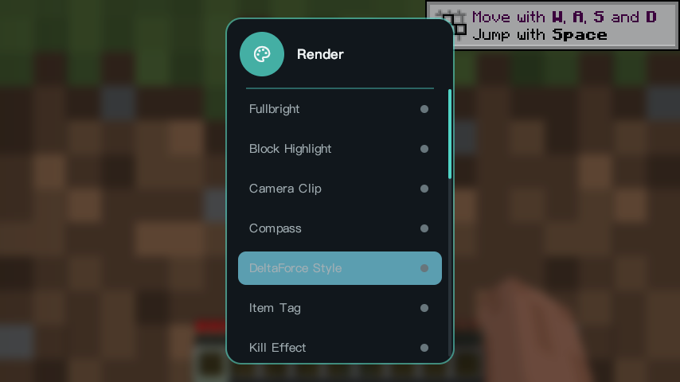
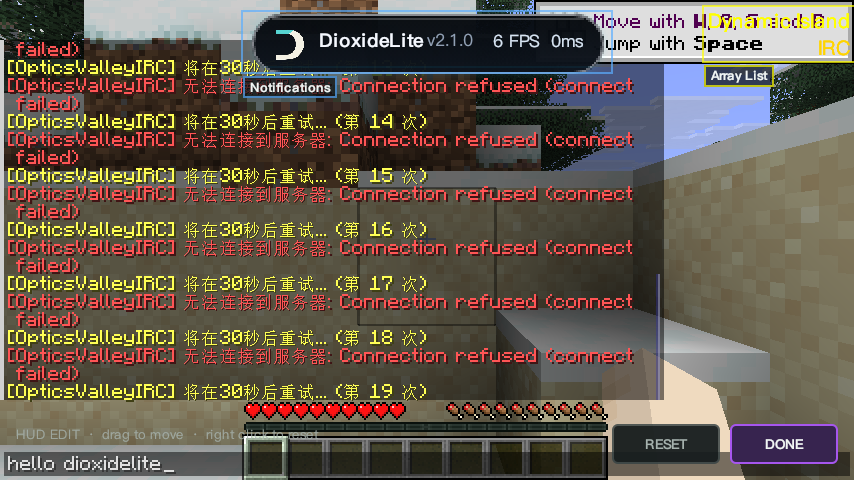
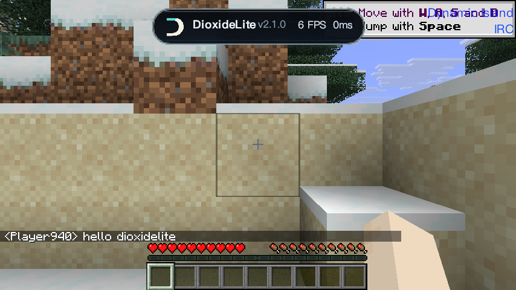
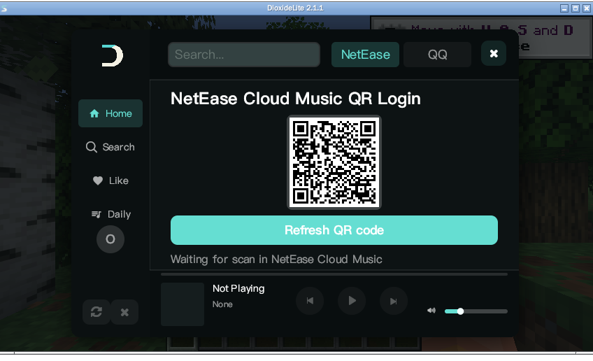
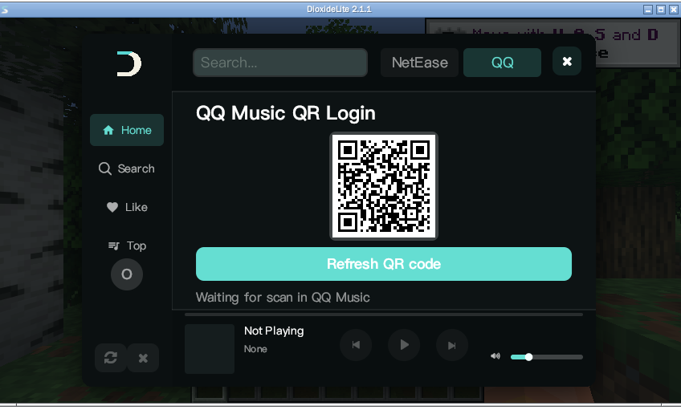

# DioxideLite

**DioxideLite** 是一个基于 Skija 渲染的 Minecraft 视觉客户端（Fabric），为 Minecraft **26.1.2** 打造，专注流畅的 HUD 视觉、ClickGUI 与聊天联动。

> 当前版本：**v2.2.6** · 平台：Fabric · 游戏版本：Minecraft 26.1.2 · JDK 25 · 支持 Windows / Linux / macOS

---

## 特性

- **Skija GPU 渲染**：全部自绘 UI（ClickGUI / HUD / 灵动岛 / Watermark）走 Skija 渲染，文字锐利、动画流畅。
- **多平台支持**：一个 jar 支持 Windows x64、Linux x64、macOS arm64（Apple Silicon）、macOS x64，零额外 native 依赖。
- **灵动岛（Dynamic Island）**：顶部胶囊信息面板，实时显示客户端版本 / FPS / 延迟。
- **Watermark**：客户端身份水印，支持自定义文字与品牌 Logo。
- **ClickGUI 双模式**：右 `Shift` 打开，`LegacyStyle`（传统窗口）+ `Setsuna`（径向轮盘），共享强调色，GUI Scale 可调。
- **HUD Editor**：聊天界面打开时可通过按键唤起，直接拖拽调整 HUD 位置（RESET / DONE）。
- **Halo 模块**：碧蓝档案头顶光环渲染（砂狼白子 / 黑见芹香 / 小鸟游星野 / Opai Logo），默认启用。
- **Onyx HUD**：ArrayList 右对齐自适应 + Notifications + PotionHUD。
- **IRC 聊天联动**（Player → IRC，默认开启）：基于 OpticsValleyIRC 原版协议，5 分钟心跳保活 + 断线自动重连，IRC 在线用户 Nametag 显示 DioxideLite 品牌 Logo。
- **视觉模块（全量移植）**：世界渲染（HoleESP / Tracers / OreTracers / SpawnerFinder / UHCDetector / Xray）、战斗（KillAura / KillAuraPlus / SilentAura / AntiBot / AutoTotem / Surround / Criticals 等）、移动（Scaffold / Clutch / Velocity / NoSlow / Speed 等）、玩家（ChestStealer / InvManager / AutoTool / BedAura 等）。
- **Vape 移植模块**：SilentAura（静默自动攻击）+ Clutch（掉落自动放方块），MovementFix 支持 Vape 三种 movementCorrection 模式。
- **内置优化模组**：Sodium / Lithium / FerriteCore 一并内嵌，开箱即用。

## 截图

| v2.2.1 主菜单 | v2.2.1 游戏内 |
| --- | --- |
|  |  |

| v2.2.0 主菜单 | ClickGUI |
| --- | --- |
|  |  |

| 游戏内灵动岛 | Render 视觉模块 |
| --- | --- |
|  |  |

| HUD Editor（聊天界面唤起） | 聊天 |
| --- | --- |
|  |  |

| 游戏内 Music · 网易云 | 游戏内 Music · QQ音乐 |
| --- | --- |
|  |  |

## Lua 脚本使用教程

DioxideLite 内置 Luaj 脚本沙箱，支持游戏内动态加载、运行、停止自定义 Lua 脚本。

### 基础操作

1. 按 **右 Shift** 打开 ClickGUI，进入 `Player` 分类，开启 `LuaScript` 总开关。
2. Lua 模块面板参数：
   - `Script Path`：脚本目录，默认 `<配置目录>/dioxidelite/scripts/`，客户端启动自动创建。
   - `Reload`：重新扫描文件夹内全部脚本。
   - `Run / Stop`：启动 / 终止当前选中脚本。
   - `Print Console`：脚本控制台，查看 `print` 输出、语法与运行报错。
3. 使用流程：
   - 将 `.lua` 脚本文件放入 `dioxidelite/scripts/`。
   - 在面板选中目标脚本，点击 `Run` 运行；使用完毕点 `Stop` 终止。

### DioxideLite Lua 核心 API

```lua
-- 获取本地玩家对象
local player = dioxidelite:getPlayer()
-- 获取游戏世界对象
local world  = dioxidelite:getWorld()
-- 向游戏聊天框发送消息
dioxidelite:sendChat("脚本消息")
-- 获取玩家射线检测信息
local ray = dioxidelite:getRaycast()
-- 设置玩家视角（yaw 水平，pitch 垂直）
dioxidelite:setYawPitch(yaw, pitch)
-- 判断按键是否按住，支持 mouse_right / mouse_left / key_w 等
local holdRight = dioxidelite:isKeyHeld("mouse_right")
```

### 自带脚本

| 脚本 | 说明 |
| --- | --- |
| `SpeedTelly` | 内置脚本，首次启动自动释放到配置 `scripts/` 目录（同名不覆盖）。仿绿玩 SpeedTelly 搭路：右键按住 + W/A/D，AIM 瞄准落点 → 放置 → FORWARD_RESET 视角前摆正疾跑 → 循环；平滑转头、角度限幅、落点有效性校验防虚空。 |

#### SpeedTelly 操作方式

1. 客户端启动后，`SpeedTelly.lua` 会自动出现在 `scripts/` 目录（已有则保留），ClickGUI → LuaScript 选中后 `Run` 启动。
2. 按住鼠标右键，预先瞄准搭路目标区域，脚本自动执行 speedtelly 搭路。
   - 方块放置完成后自动回正视角，维持疾跑提速。
   - 当前版本为硬锁视角，保证瞄准精度。
   - 搭路距离、视角平滑系数、回正速度均可在 Lua 子面板实时调参。
3. 松开鼠标右键，自动停止搭路循环。

### 常见问题

- **脚本不生效**：确认 LuaScript 模块已开启；打开控制台查看报错；脚本编码使用 UTF-8，文件名避免中文特殊字符。
- **切换脚本**：必须先 `Stop` 当前运行脚本，再选择其他脚本 `Run`。
- **客户端重启**：重启后脚本不会自动运行，需手动重新 `Run`；可勾选 AutoLoad 实现开机自动加载。

## 安装

1. 安装 **Fabric Loader ≥ 0.19.2**，游戏版本 **26.1.2**。
2. 安装 **Fabric API**（26.1.2 对应版本）。
3. 将 `DioxideLite-2.2.5.jar` 放入 `.minecraft/mods`。
4. 启动游戏。`右 Shift` 打开 ClickGUI，灵动岛默认开启。

## IRC 使用

- 默认开启（ClickGUI → Player → IRC 可关闭）。
- 需配合 OpticsValleyIRC 服务器（默认端口 `16688`）。
- 聊天互通：游戏内聊天即发送至 IRC，服务器广播以 `[OpticsValleyIRC]` 前缀显示。
- Nametag Logo：IRC 在线用户名字左侧显示 DioxideLite Logo，仅本客户端可见。
- 5 分钟心跳保活，断线自动指数退避重连。

## 构建

使用 JDK 25：

```bash
# 全平台构建（Windows + Linux + macOS）
./gradlew clean build \
  -Pskija_platforms=skija-windows-x64,skija-linux-x64,skija-macos-arm64,skija-macos-x64 \
  -Pwebrtc_platforms=windows-x86_64,linux-x86_64,macos-aarch64,macos-x86_64

# 单平台构建（更小 jar）
./gradlew clean build -Pskija_platforms=skija-windows-x64 -Pwebrtc_platforms=windows-x86_64
```

产物位于 `build/libs/DioxideLite-2.2.5.jar`。

> 注意：构建依赖 `libs/nested/` 下的内嵌库与 `src/main/java/tritium`、`src/main/java/repackage`（音频 / JSyn 库），均已随仓库提供。

## 更新日志

| 版本 | Devlog |
| --- | --- |
| v2.2.6 | [devlog-2.2.6.md](devlog-2.2.6.md) — 新增主菜单视频背景（VideoBackgroundBaker/Player + 烘焙进度）+ 游戏菜单 GameMenuScreen + 主题化控件（EditBox/Slider）+ UiText 本地化 + Skybox 重构 + 全平台原生库依赖 |
| v2.2.5 | [devlog-2.2.5.md](devlog-2.2.5.md) — 补全 Animations / FogBlur / PostProcessing / Skybox 四模块真实实现 + 新增 BedDefender（Combat）+ 全平台原生库依赖 |
| v2.2.4 | [devlog-2.2.4.md](devlog-2.2.4.md) — 静默旋转引擎重构（Vape PID）+ SilentAura 重构 + 新增 LegitScaffold/AttackEffects/BreakProgress/NoFOV/NoHurtCamera/PostProcessing/StreamerMode/TitleChanger + ESP 增强 + 移除装饰模块 |
| v2.2.3 | [devlog-2.2.3.md](devlog-2.2.3.md) — Vape 移植（SilentAura + Clutch）+ MovementFix 三种模式 + Lua 内置脚本 + 网易云扫码登录修复 |
| v2.2.2 | [devlog-2.2.2.md](devlog-2.2.2.md) — 多平台移植 + ClickGUI 双模式 + Render 模块重组 + 品牌清理 |
| v2.2.1 | [devlog-2.2.1.md](devlog-2.2.1.md) — HUD resize + chat editor + ChatScreenMixin 修复 + Halo 模块 |
| v2.2.0 | [devlog-2.2.0.md](devlog-2.2.0.md) — Render 优化 + ClickGUI 优化 + 编译修复 |
| v2.1.5 | [devlog-2.1.5.md](devlog-2.1.5.md) — RenderStable OnyxPort + 编译修复 |
| v2.1.4 | [devlog-2.1.4-onyx-engine-migration-cn.md](devlog-2.1.4-onyx-engine-migration-cn.md) — Onyx Engine 迁移 + 11 个新模块 |
| v2.1.3 | [devlog-2.1.3-bilingual.md](devlog-2.1.3-bilingual.md) — OpenOnyx 视觉适配 + OPAI_ONYX 主题 + 多分辨率窗口图标 |
| v2.1.2 | [devlog-2.1.2.md](devlog-2.1.2.md) — 修复 Windows 运行失败 + 去除 setsuna 字样 + 自定义背景 |
| v2.1.1 | [devlog-2.1.1.md](devlog-2.1.1.md) — 视觉模块全量移植 + Music 模块 + 灵动岛 + Lua 脚本沙箱 |
| v2.1.0 | [devlog-2.1.0.md](devlog-2.1.0.md) — 初始 Skija 渲染 + ClickGUI + IRC 联动 |

详细更新记录见 [CHANGELOG.md](CHANGELOG.md)。

## 许可

本项目基于 **GPL-3.0-or-later** 开源（详见 [LICENSE](LICENSE)）。

## 联系

QQ：**81622964**
